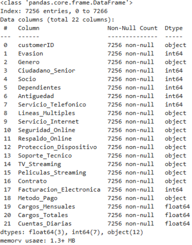
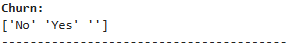
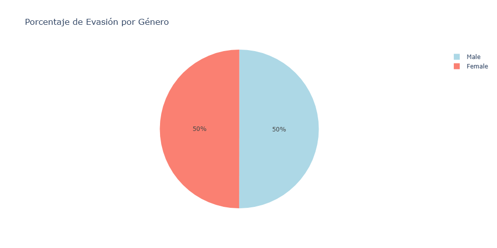
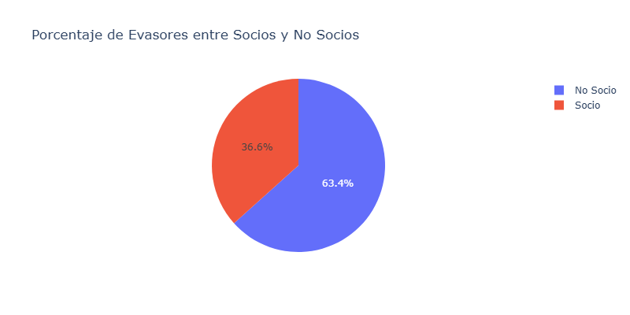
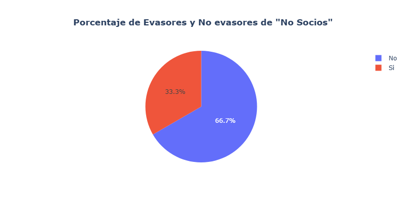
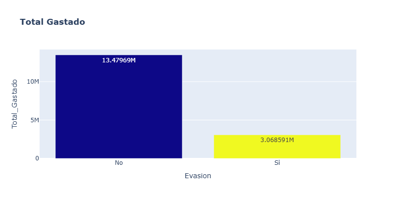
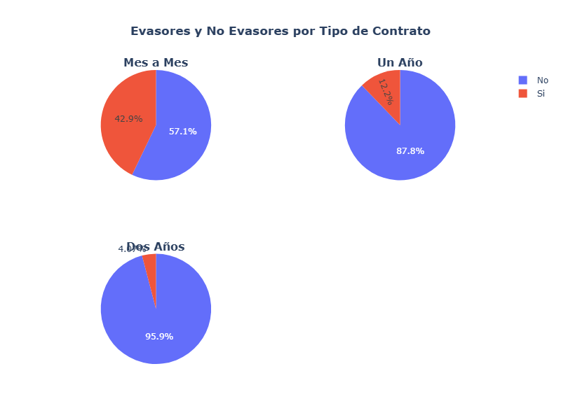
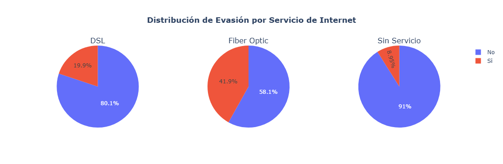

# Informe Final

## Introduccion
El churn de clientes es simplemente la tasa a la que los usuarios dejan de usar un servicio en un período determinado. En el contexto de las telecomunicaciones, es un dato muy importante porque influye directamente en los ingresos y en qué tan estable puede ser una compañía. Revisar y entender por qué los clientes se van ayuda a descubrir qué factores están causando esa pérdida y a crear estrategias para retenerlos mejor. Todo esto basado en datos, lo que hace que las decisiones sean más acertadas y que la evasión se reduzca.

## Limpieza y Tratamiento de Datos
Primero que nada, vemos que el DataFrame inicial consta de 4 columnas que contienen diccionarios, por ello, deberemos de utilizar la funcion ```json_normalize()``` junto a ```DataFrame.concat()``` para obtener un nuevo conjunto de datos con todas las columnas que estaban agrupadas en diccionarios. Luego, verificamos con la funcion ```.info()``` si es que el conjunto de datos contiene valores Nulos, en este caso no tenemos:
<p align="center">
    
</p>
Pero, al analizar cada columna con la funcion ```.unique()``` comprobamos que hay algunos valores vacios en **Churn**
<p align="center">
    
</p>

**Esto nos indica que tenemos valores faltantes que, si bien no son NaN, obstruyen en analisis... En este caso se opto por rellenar dichas filas con los valores ***Yes*** y ***No*** de forma aleatoria para solucionar este problema.
Finalizado todo lo anterior, ya tenemos listo el DataSet para continuar con el Analisis Exploratorio de los datos.**

## Análisis Exploratorio de Datos

### **Analizamos la distribucion Total de los Evasores**
<p align="center">
    
</p>

**Segun esto, podemos concluir que aproximadamente 1/4 de los usuarios que contratan los servicios de la empresa terminan Cancelando su contrato.**
### **Analizamos la distribucion de los Evasores segun el Genero (Sin contar los No Evasores)**
<p align="center">
    
</p>

**Como se puede observar, la distribucion de evasores segun el genero es casi identica, por lo que no se puede obtener mucha informacion de esto.**
### Analizamos el Porcentaje de evasores entre socios y no socios
<p align="center">
    
</p>

**Esto nos indica que los No Socios tienden mas a abandonar la empresa. Ahora haremos el mismo grafico pero solo con los No Socios y verificaremos los % correspondientes**
### Analizamos el % de evasores y no evasores de aquellos que no son socios
<p align="center">
    
</p>

**A partir de estos datos complementarios, podemos concluir que, aunque la mayoría de los clientes que abandonan la empresa son No Socios, dentro de este grupo solo el 33.4% presenta evasión. Esto indica que, si bien es un segmento con alta representación en los casos de abandono, la mayoría de estos se mantiene activo**
### **Analizamos el Total Gastado entre aquellos que Evaden y los que No Evaden**
<p align="center">
    
</p>

**Los clientes que no evaden gastan aproximadamente 4 veces más que los que sí evaden. Esto indica que los evasores representan una pequeña parte de las ganancias de la empresa.**

### **Analizamos los Porcentajes de evasion segun el tipo de contrado de los usuarios***
<p align="center">
    
</p>

**Como se puede apreciar, la evasión de clientes disminuye notablemente a medida que aumenta la duración del contrato.**
* ***Contrato Mes a Mes***: Mas de la mitad (57.1%) son evsaores. Esto da un indicio de que aquellos clientes mas 'flexibles' tienden a cancelar frecuentemente.

* ***Contrato de Un Año y Dos Años***: Aqui la evasion es baja, da a entender que los clientes con contratos de 1 y 2 años son mas 'fieles' a la empresa

### **Analizamos los Porcentajes de evasion segun el tipo de Servicio de Internet**
<p align="center">
    
</p>

**Esto nos indica que es mas probable que haya evasores de aquellos clientes que contratan fibra optica y DSL, pobablemente por problemas de conexion u mala señal... Por lo tanto es recomendable analizar que esta pasando con los servicios de DSL y Fibra Optica.**
# Conclusiones e Insights
1. Alta Tasa de cancelarion, aproximadamente del 25%
2. El Genero no influye en la tasa de evasion
3. Respecto a los evasores segun si el usuario es socio o no, se identifico que, si bien la mayoria de los evasores no son socios, solo el 33% de estos termina cancelando su contrato con la empresa.
4. Se identifico que gran parte de los evasores corresponde a usuarios con contratos de Mes a Mes, mientras que aquellos que contratan por 1 o 2 años son mas fieles a la empresa.
5. Respecto al tipo de servicio de internet, se logro identificar que los usuarios que contratan DSL o Fibra Optica tienden mas a cancelar su contrato con la empresa, esto puede estar relacionado a problemas con el servicio que se les ofrece, como mala cobertura.

# Recomendaciones 
1. **Monitorear y mejorar la calidad del servicio en DSL y Fibra Óptica:** Es importante seguir de cerca cómo funcionan estas conexiones, ya que suelen tener una tasa de cancelación más alta. Se recomienda hacer un diagnóstico técnico para detectar posibles problemas con la cobertura, la velocidad o la estabilidad, y luego implementar planes de mejora que realmente mejoren la experiencia del usuario.
2. **Fortalecer la fidelización de los clientes que aún no son socios:** Aunque no ser socio no significa que tengan muchas cancelaciones, este grupo representa una gran parte de quienes cancelan. Se pueden diseñar programas para que se sientan más leales, como ofrecer membresías con beneficios especiales o premios.
3. **Crear campañas específicas para clientes que solo tienen contrato mes a mes:** Este grupo presenta la mayor tasa de cancelación, así que vale la pena ofrecer incentivos como descuentos, beneficios exclusivos o upgrades gratis si optan por contratos más largos, de uno o dos años.
